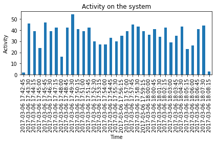
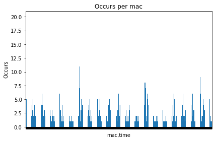
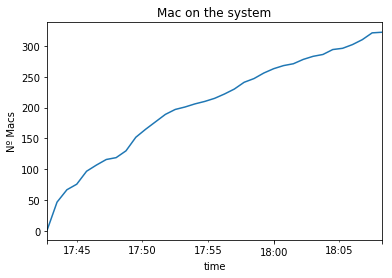
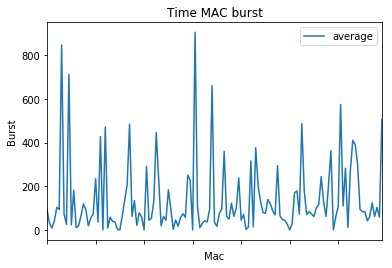
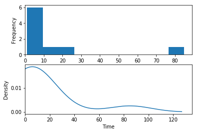

# CountingPeople

## Static statistics 
### Description

The following code generates some statistics used to annalyse our system.

### Requisites

    - Python 3.6
    - Pandas
    - Matplotlib
    - numpy
    - Ipython

### Functions

    - read_csv: read the csv and parse it to dataFrame

    - consult_api: call to the API, get the csv and parse it to dataFrame

    - origin_activity: plot all the activity on the system.

    - mac_activity: plots the activity each mac along the time 

    - mac_system: Plot the acumulated number of macs in the system

    - T_burst: Plot the time between burst for each mac, and plot the average time between burst. 


Main program example with results


```python
#df = consult_api()
df = read_csv('Captura_Peritos.csv')
```

```python
mac_activty_good(df, True)
```


```python
mac_activity_bad(df, True)
```



```python
origin_activity(df, True)
```


```python
mac_occurs(df, True)
```


```python
mac_system(df, True)
```


```python
T_burst(df, True)
```






